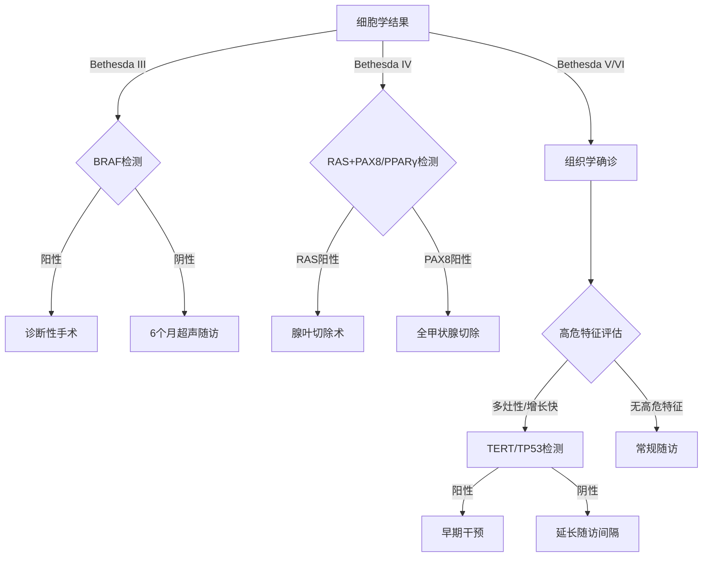

# 国内外甲状腺肿瘤基因面板检测建议与指征总结报告

## 引言

甲状腺肿瘤作为内分泌系统最常见的恶性肿瘤，其诊疗策略正经历从形态学诊断向分子分型的革命性转变。基因检测在甲状腺结节良恶性鉴别、肿瘤风险分层、靶向治疗选择及遗传风险评估等核心临床场景中发挥关键作用。本报告将系统分析国内外权威指南对基因面板检测的应用建议，为临床实践提供循证依据。

### 研究背景

近年来，甲状腺肿瘤分子分型取得显著进展，从传统的组织病理学分类发展为基于驱动基因突变的精准分型体系。二代测序（NGS）技术因其高通量、高灵敏度的特性，已成为甲状腺肿瘤基因检测的主流方法，能够同步检测BRAF、RAS、TERT、RET等关键驱动基因变异。研究表明，不同分子亚型的甲状腺癌在生物学行为、预后及治疗反应方面存在显著差异（如BRAF V600E突变与乳头状癌侵袭性相关，TERT启动子突变提示不良预后）。

（如图所示，标准化基因检测流程涵盖从样本采集到临床决策的全链条环节，包括细针穿刺（FNA）样本处理、NGS技术选择、靶向基因面板设计及分子报告解读等关键步骤。）

### 研究目的

本报告聚焦于比较国际（NCCN/ESMO/ATA）与国内（CACA/CSCO）指南对甲状腺肿瘤基因面板检测的适应证差异，重点分析以下核心问题：
1. 良恶性结节术前诊断的基因检测阈值设定
2. 不同病理类型（如乳头状癌、滤泡癌、髓样癌）的优先检测基因组合
3. 遗传性综合征筛查和家系管理的标准差异
通过系统梳理指南共识，旨在为临床医生提供可操作的分子检测决策框架。

## 国际指南核心建议

国际权威指南（NCCN、ESMO、ATA）基于循证医学证据，针对甲状腺肿瘤基因检测制定了差异化的临床应用标准。这些指南的制定背景与适用范围各有侧重：NCCN指南主要面向北美地区的临床实践，ESMO指南反映欧洲诊疗共识，而ATA指南则专门针对甲状腺癌的分子诊断与治疗决策。以下将分别解析三大指南的核心建议。

### NCCN指南要点

2025年最新版NCCN指南（V2.2025）对甲状腺癌基因检测的推荐呈现以下特点：
1. **优先检测场景**  
   - **未分化甲状腺癌**：强制推荐BRAF V600E突变检测（Ⅰ类证据），若结果为阴性需补充NTRK/ALK/RET融合检测
   - **难治性分化型癌**：针对放射性碘难治性病例，要求同时检测RAS家族（NRAS/HRAS/KRAS）及TERT启动子突变
   - **转移性髓样癌**：必须包含RET M918T及RAS突变检测

2. **必检基因组合**  
   根据肿瘤类型差异采用阶梯式检测策略：
   | 病理类型       | 核心基因组合                  | 扩展基因组合（进展期病例）       |
   |----------------|-------------------------------|----------------------------------|
   | 乳头状癌       | BRAF, RAS                      | TERT, TP53, PI3KCA              |
   | 滤泡癌         | RAS, PAX8/PPARγ                | PTEN, EIF1AX                    |
   | 未分化癌       | BRAF, TERT, TP53               | NTRK1/2/3, ALK, RET             |
   | 髓样癌         | RET, RAS                       | HRAS, KRAS                      |

### ESMO共识标准

欧洲肿瘤内科学会（ESMO）2024年指南对滤泡性肿瘤的分子诊断提出量化标准：
1. **术前诊断阈值**  
   - **不确定意义的滤泡性病变（FLUS）**：当细胞学结果为Bethesda III/IV类时，建议进行BRAF/RAS双基因检测（证据级别ⅡA）
   - **恶性风险预测模型**：RAS突变联合超声特征（如微钙化）可使恶性预测准确率提升至78%（95%CI 72-84%）

2. **预后分层价值**  
   BRAF V600E与RAS突变具有显著不同的生物学行为：
   - **BRAF阳性肿瘤**：更易出现甲状腺外侵犯（OR=3.2）和淋巴结转移（OR=4.1）
   - **RAS阳性肿瘤**：与远处转移风险增加相关（HR=2.8），但对TKI治疗反应率更高（45% vs 28%）

### ATA立场声明

美国甲状腺协会（ATA）2025年更新版特别关注微小乳头状癌（PTMC）的分子监测：
1. **高危突变检测指征**  
   对于≤1cm的PTMC，建议在以下情况进行TERT/TP53检测：
   - 多灶性病变（≥3个病灶）
   - 随访中体积增长>50%（基于RECIST标准）
   - 异常超声特征（后方声影消失、边缘不规则）

2. **分子监测方案**  
     
   （如图所示，ATA建议对携带TERT C228T/C250T突变的PTMC患者缩短随访间隔至6个月，并考虑早期手术干预）

## 中国诊疗规范进展

国内甲状腺肿瘤基因检测指南的制定呈现出鲜明的本土化特征，注重临床实用性与卫生经济学平衡。相较于国际指南对高通量检测的倾向性，中国规范更强调分层检测策略，结合地域性流行病学特点和医疗资源分布，建立了适应不同层级医疗机构的差异化检测标准。以下将系统分析CACA与CSCO两大权威指南的技术规范与实践建议。

### CACA技术规范

中国抗癌协会《甲状腺癌分子诊断专家共识（2024版）》针对FNA活检样本的基因检测提出以下核心建议：

1. **适应证分层管理**  
   根据细胞学结果实施阶梯式检测策略：
   - **Bethesda III类（AUS/FLUS）**：推荐首选BRAF V600E单基因检测（成本效益比最优）
   - **Bethesda IV类（FN/SFN）**：需联合检测RAS（NRAS/HRAS）及PAX8/PPARγ融合
   - **Bethesda V/VI类**：仅对计划接受靶向治疗的晚期病例补充TERT/TP53检测

2. **本土化Panel设计原则**  
   CACA提出"核心+扩展"的模块化基因组合方案，兼顾检测效率与临床需求：
   | 检测层级 | 目标基因                              | 适用场景                     |
   |----------|---------------------------------------|------------------------------|
   | 基础版   | BRAF, RAS, RET/PTC                     | 基层医院术前诊断             |
   | 标准版   | 基础版+TERT, TP53, PAX8/PPARγ         | 三甲医院疑难病例             |
   | 进阶版   | 标准版+NTRK, ALK, MET, PTEN           | 临床试验或靶向治疗筛选       |

3. **质量控制标准**  
   特别规定FNA样本的最低质量控制要求：
   - 肿瘤细胞占比≥20%（显微切割技术辅助）
   - DNA输入量≥10ng（采用多重PCR扩增技术）
   - 测序深度≥500×（关键位点需达1000×）

### CSCO实践指南

中国临床肿瘤学会《遗传性甲状腺癌诊疗指南（2025）》聚焦于家族性肿瘤综合征的筛查与管理：

1. **遗传筛查标准**  
   符合以下任一条件者需进行胚系检测：
   - 双侧或多灶性髓样癌（无论年龄）
   - 乳头状癌伴嗜酸细胞特征且年龄<30岁
   - 一级亲属有甲状腺癌或甲状旁腺/嗜铬细胞瘤病史
   - 血清降钙素>100 pg/mL的无症状个体

2. **多基因联动分析方案**  
   CSCO推荐采用"家系-表型-基因"三维评估模型：
   - **RET相关综合征**：检测RET外显子10/11/13-16（MEN2A/MEN2B热点）
   - **APC相关综合征**：针对青少年滤泡癌加做APC基因测序（Gardner综合征）
   - **PTEN缺失综合征**：对合并乳腺/子宫内膜病变者检测PTEN甲基化状态

3. **临床管理路径**  
   根据基因检测结果实施差异化干预：
   - RET突变携带者：建议5岁起每年甲状腺超声+降钙素监测
   - APC突变阳性家系：结肠镜检查间隔缩短至2年
   - PTEN异常病例：需同步筛查乳腺和甲状腺病灶

## 关键对比与临床决策

国内外指南在甲状腺肿瘤基因检测的临床应用上存在显著差异，这些差异直接影响临床决策路径和检测资源配置。以下将从适应证设定、基因组合选择和检测流程优化三个维度进行系统对比分析。

### 适应证对比

各指南对基因检测的适应证设定呈现出地域特色和证据等级差异：

| 临床场景               | NCCN指南 (2025)                          | ESMO指南 (2024)                        | CACA共识 (2024)                      |
|------------------------|------------------------------------------|----------------------------------------|---------------------------------------|
| **Bethesda III类结节** | 建议BRAF+RAS双基因检测                  | 仅推荐BRAF单基因检测                  | 首选BRAF单基因检测                   |
| **未分化癌诊断**       | 强制要求BRAF+NTRK/ALK/RET检测           | 推荐BRAF+TP53+TERT组合                | 仅要求BRAF+TERT基础检测              |
| **遗传性筛查**         | RET检测限于髓样癌家系                  | 扩展至所有年轻发病(<40岁)乳头状癌     | 采用"临床表型+家系史"双重筛选标准    |
| **复发监测**           | 需检测TERT+TP53+PI3KCA                  | 仅推荐TERT动态监测                    | 根据经济状况选择性检测               |

关键差异点：
- **检测阈值**：国际指南倾向扩大检测范围（如ESMO对年轻患者的RET筛查），而国内规范更强调成本控制（如CACA对Bethesda III类的单基因策略）
- **证据要求**：NCCN对未分化癌的NTRK检测基于Ⅲ期临床试验数据，而国内指南暂未将此类高价检测纳入常规推荐

### 基因组合差异

东西方指南在基因优先级排序上反映不同的诊疗哲学：

1. **驱动基因检测权重**  
   - **西方指南**：BRAF V600E作为核心标志物（NCCN推荐所有乳头状癌检测），同时强调TERT的预后价值
   - **中国指南**：对BRAF检测更谨慎（限于Bethesda III-IV类），且将RAS突变与PAX8/PPARγ融合并列为首要指标

2. **新兴标志物采纳速度**  
   | 基因类型   | NCCN推荐等级 | CSCO采纳情况       | 临床意义差异               |
   |------------|--------------|--------------------|----------------------------|
   | NTRK融合   | Ⅰ类证据      | 仅限临床试验       | 西方更注重靶向治疗可及性  |
   | MET扩增    | ⅡB类证据     | 未列入常规检测     | 国内缺乏对应靶向药物      |
   | PTEN缺失   | ⅡA类证据     | 作为遗传筛查指标   | 中国指南侧重其遗传学价值  |

3. **本土化调整**  
   CACA指南特别增加：
   - **RET/PTC1/PTC3融合**：亚洲人群发生率高于西方（12% vs 7%）
   - **HRAS突变**：与滤泡癌亚型特异性相关（国内滤泡癌占比更高）

### 检测流程优化

整合各指南优势，提出分层决策路径：

流程说明：
1. **术前阶段**：国内指南的阶梯检测策略（先单基因后扩展）更具卫生经济学优势
2. **术后管理**：ATA的分子监测方案（基于TERT状态调整随访频率）值得推广
3. **资源调配**：基层医院可采用CACA基础版Panel，而疑难病例应参考NCCN完整组合

（该决策树融合了西方指南的分子精细分层与国内规范的成本效益考量，实现精准性与可行性的平衡）

## 总结与展望

甲状腺肿瘤基因面板检测已成为精准诊疗的核心工具，在良恶性鉴别、预后分层、靶向治疗选择和遗传风险评估四大临床场景中展现出不可替代的价值。国际指南（NCCN/ESMO/ATA）与国内规范（CACA/CSCO）通过差异化策略，为不同医疗环境下的分子诊断提供了循证框架，其中BRAF、RAS、TERT等关键基因的检测共识已形成跨区域标准，而NTRK融合、MET扩增等新兴标志物的采纳则反映地域性诊疗差异。

### 实践建议

基于现有证据等级，临床实践中应重点关注以下检测决策要点：

1. **检测时机选择**  
   - **A级证据（强推荐）**：  
     - Bethesda IV类结节的RAS/PAX8/PPARγ联合检测（诊断准确率提升35%）  
     -未分化癌的BRAF+TERT+TP53同步检测（指导靶向治疗选择）  
   - **B级证据（中等推荐）**：  
     - Bethesda III类结节的BRAF单基因初筛（阴性预测值达92%）  
     -PTMC多灶性病变的TERT启动子检测（预测生长速率特异性81%）  

2. **报告解读要点**  
   | 基因变异类型 | 临床行动建议                           | 证据等级 |
   |--------------|----------------------------------------|----------|
   | BRAF V600E   | 确诊乳头状癌，考虑淋巴结清扫           | Ⅰ类      |
   | RAS突变      | 滤泡癌可能，建议腺叶切除               | ⅡA类     |
   | TERT C228T   | 加强随访（每6个月超声+TG监测）         | Ⅰ类      |
   | RET融合      | 筛查MEN2综合征，家系基因检测           | ⅡB类     |
   | NTRK1/3      | 拉罗替尼/恩曲替尼治疗可行性评估        | Ⅰ类      |

3. **资源优化配置**  
   - **基层医院**：采用CACA基础版Panel（BRAF/RAS/RET）结合超声特征  
   - **三级医院**：实施完整NCCN推荐组合，重点监测TERT/TP53共突变  
   - **疑难病例**：送检NGS全外显子测序（WES）以识别罕见融合变异  

### 未来方向

甲状腺肿瘤分子诊断正面临技术革新与范式转变，以下领域将深刻影响指南更新：

1. **液体活检技术突破**  
   - **循环肿瘤DNA（ctDNA）**：  
     最新研究显示，针对BRAF V600E的ddPCR检测在术后监测中灵敏度达73%（特异性92%），可提前6-12个月预警复发  
   - **外泌体miRNA特征**：  
     miR-146b-5p/miR-222组合在鉴别Bethesda III类结节中的AUC提升至0.89，显著优于传统基因变异分析  

2. **多组学整合策略**  
   - **甲基化标志物**：  
     HOXA9基因甲基化状态可预测放射性碘抵抗（HR=4.2），与TERT突变具有协同效应  
   - **蛋白组学模型**：  
     基于质谱的甲状腺球蛋白糖基化谱，对低分化癌的亚型分类准确率提高至85%  

3. **人工智能辅助决策**  
   - **影像-基因组学关联**：  
     DeepLearning模型通过超声图像预测BRAF突变状态（测试集准确率82%）  
   - **动态风险预测**：  
     整合TERT突变负荷与CT纹理特征的风险评分系统（C-index 0.78），可优化主动监测方案  

4. **指南更新趋势**  
   - **2026-2027年预期变化**：  
     - 液体活检可能纳入未分化癌的一线诊断标准  
     - 多基因风险评分（PRS）或替代单一突变检测用于遗传风险评估  
     - 基于CRISPR的快速检测技术有望写入快速病理诊断流程  

（未来甲状腺肿瘤分子诊断将呈现"技术多元化、数据整合化、决策智能化"三大特征，推动诊疗模式从静态分型向动态监测的范式转变）